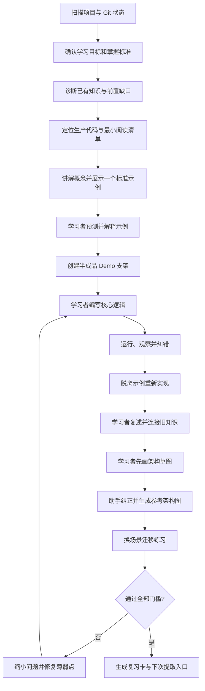
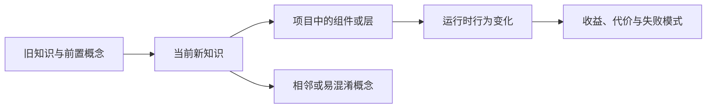

# `learn-project` v2 增强与重构设计

日期：2026-07-13
状态：待用户批准后实现

## 1. 背景

现有 `learn-project` 已经具备以下有效能力：

- 通过诊断问题发现知识缺口；
- 把新知识连接到已有知识；
- 要求学习者解释、复述和重写；
- 用小型 Demo 学习项目中的真实流程；
- 让助手处理基础设施，让学习者聚焦核心逻辑；
- 纠正错误的心智模型，而不只修复语法。

本次不创建第二个重复 skill，而是在原有 `learn-project` 上增强并重构，使其成为能够自动适配 Java、Python 等项目的通用“项目学习教练”。

## 2. 目标

### 2.1 核心目标

1. 进入任意项目后，先读取项目指令、语言、构建方式、Git 状态和既有目录约定。
2. 在安全的学习分支与学习目录中创建最小 Demo 支架。
3. 助手负责环境、数据、适配器、测试和运行入口，学习者优先编写目标业务逻辑。
4. 学习过程从标准示例逐步过渡到半成品、脱离示例重写和换场景迁移。
5. 强制学习者解释知识、连接旧知识、暴露推理过程并修正错误模型。
6. 先由学习者梳理架构，再由助手纠正并生成标准参考图。
7. 用明确的通关门槛区分“代码跑通”和“真正学会”。
8. 将 GitHub 仓库作为 skill 源码的唯一事实来源，并同步到本机 Codex skill 目录。

### 2.2 非目标

- 不做完整课程平台、题库系统或学习管理系统。
- 不在 skill 内硬编码只适用于 Spring Boot、Python Agent 或某个固定项目的目录。
- 不默认替学习者写完核心 Demo。
- 不把一次运行成功当作掌握。
- 不自动创建提醒或后台任务；只有用户明确要求时才使用自动化。
- 不默认修改 Gemini、WorkBuddy 或其他工具中的 skill 副本。

## 3. 设计原则

### 3.1 学习者必须产生可检查的输出

每个知识点都要求学习者产生至少四类输出：

1. 核心代码；
2. 对执行流程和设计原因的解释；
3. 与旧知识的连接；
4. 架构位置与关系草图。

助手不能用一篇完整讲解代替这些输出。

### 3.2 支架逐步淡出

学习初期降低无关认知负担，但学习者承担的责任必须逐步增加：

```text
标准示例
→ 缺失核心逻辑的半成品
→ 只保留接口、输入和验证
→ 脱离参考独立重写
→ 换业务场景迁移
```

“只写业务逻辑”是默认起点，不是永久模式。

### 3.3 先提取，再纠正

助手应先让学习者预测、复述、画图或解释，再提供纠正。这样才能发现真实心智模型，而不是让学习者对标准答案产生熟悉感。

### 3.4 真实项目形状，最小学习范围

Demo 应保留真实项目的关键输入、边界和执行形状，但只包含当前概念所需的最小流程。真实数据库、JSON、API、向量库可以通过薄适配器接入；不稳定的 LLM、外部服务和凭据依赖使用确定性替身。

### 3.5 安全优先于自动化

skill 可以自动检查项目，但不能在脏工作区中擅自切分支、stash、覆盖文件或删除学习成果。无法安全判断时，只问一个最关键的问题。

## 4. 总体学习流程



## 5. 项目自动适配

### 5.1 项目画像

skill 开始学习会话时，在上下文中建立一个临时 `ProjectProfile`：

```text
ProjectProfile
- repository_root
- project_instructions
- current_branch
- worktree_status
- languages_and_frameworks
- build_and_run_commands
- source_roots
- test_roots
- existing_learning_locations
- existing_learning_branch
- architecture_and_business_docs
- usable_real_data_sources
```

该画像默认不写入额外配置文件，避免为推测出来的信息制造维护负担。

### 5.2 检查顺序

1. 找到当前任务对应的仓库根目录；多仓库且目标不明确时询问用户。
2. 读取适用的 `AGENTS.md`、`CLAUDE.md`、`GEMINI.md` 和项目约定。
3. 检查 Git 当前分支、已有学习分支和工作区是否干净。
4. 识别语言与构建工具，例如 Maven、Gradle、Python、Node.js。
5. 查找已有的 `learn`、`learning`、`learning_demos`、`examples` 或类似目录。
6. 查找最小运行命令、测试命令以及可复用的数据入口。
7. 向用户说明即将使用的分支、目录、运行方式和由用户负责的代码范围。

### 5.3 学习分支决策

按以下优先级选择：

1. 项目指令明确指定的学习分支；
2. 当前已位于项目既有的学习分支；
3. 仓库已有 `learn` 或语义相同的分支；
4. 没有约定时，提议使用 `learn`，得到同意后再创建或切换。

安全约束：

- 工作区有未提交改动时，不自动切换或创建分支；
- 不自动 stash；
- 不覆盖现有 Demo；
- 分支操作前说明影响；
- 仅学习且不需要写文件时，可以留在当前分支。

### 5.4 学习目录决策

优先复用项目已有约定，不强制所有语言使用同一路径。

典型候选：

| 项目 | 优先查找的学习位置 |
|---|---|
| Java/Maven | 既有 `learning`/`learn` package；否则在现有包根下提议 `learning` |
| Java/Gradle | 遵循当前 source set 和 package 结构 |
| Python | 既有 `learning_demos/`、`learn/` 或独立示例包 |
| Node.js/TypeScript | 既有 `examples/`、`learn/` 或测试旁的最小 Demo |
| 多语言项目 | 把 Demo 放在当前知识所属的子项目中，不放在工作区顶层 |

创建前必须展示最终路径，避免把“自动适配”变成不可预测的文件散落。

## 6. Demo 教学协议

### 6.1 Demo 必须满足的条件

- 一次只学习一个核心概念或一条核心流程；
- 输入和预期输出清晰；
- 可以通过一个最小命令运行或验证；
- 与生产代码有明确映射，但不复制整套生产实现；
- 用户负责的区域用清晰的 TODO 标出；
- 助手准备的基础设施不隐藏关键业务因果关系；
- 不引入仅为 Demo 服务的新框架或复杂抽象。

### 6.2 四级支架

#### Level 1：标准示例

助手展示一个最小正确例子，讲清：

- 输入与输出；
- 标准结构；
- 每个关键决策的原因；
- 常见错误；
- 与项目生产代码的对应关系。

学习者必须先预测运行轨迹并解释示例，不能直接复制。

诊断结果表明学习者已经掌握标准结构时，可以压缩或跳过完整示例，但仍要先确认标准方法、关键约束和判断清单，再进入独立实现或迁移练习。

#### Level 2：核心逻辑填空

助手创建数据、适配器、测试、运行入口和接口骨架；学习者编写路由、状态更新、校验、分支决策、事务顺序、工具编排等目标逻辑。

#### Level 3：脱离示例重写

隐藏或停止参照标准实现，只保留需求、接口、输入和验证，由学习者重写核心流程。

#### Level 4：迁移练习

更换业务情境或约束，让学习者判断原方法哪些保持不变、哪些必须调整。迁移任务应小于原 Demo，但不能只改变量名。

## 7. 解释、纠错与提示阶梯

### 7.1 学习者解释模板

```text
它解决的问题：
输入从哪里来：
核心流程：
为什么按这个顺序：
失败时会怎样：
与生产代码的对应位置：
关联的旧知识：
相同点：
不同点：
最容易混淆的地方：
```

### 7.2 错误分类

助手先判断错误属于哪一类：

- 语法或 API 使用；
- 控制流和执行顺序；
- 数据与状态模型；
- 业务规则；
- 系统边界或职责归属；
- 架构关系；
- 前置知识缺口；
- 偶然疏忽。

### 7.3 纠错顺序

1. 指出具体不一致，而不是直接给完整答案。
2. 询问学习者为什么这样写或这样理解。
3. 修正背后的模型。
4. 只让学习者重写错误部分。
5. 重新运行或重新解释。
6. 在后续脱离示例阶段再次提取。

提示按以下阶梯逐渐增强：

```text
问题提示 → 约束提示 → 流程提示 → 伪代码 → 最小参考片段
```

除非学习者明确要求放弃练习，否则不直接跳到完整答案。

## 8. 架构与知识图谱

不维护一张无限膨胀的大图。每个主题使用三张小图表达不同问题：

1. **知识连接图**：新知识与旧知识的相同点、差异和前置关系；
2. **运行流程图**：请求、数据或状态在运行时如何流动；
3. **项目位置图**：该知识属于项目哪一层，与哪些组件交互。

### 8.1 学习者先画

学习者先用文字、ASCII 或 Mermaid 给出草图，至少回答：

```text
这个知识属于哪一层？
上游是谁？
下游是谁？
依赖什么？
改变了原有流程的哪一部分？
不使用它时，旧流程如何工作？
```

### 8.2 助手纠正

助手用以下格式反馈：

```text
正确关系：
遗漏关系：
错误方向：
混淆的层次：
建议重画：
```

学习者完成第二版后，助手再生成标准参考 Mermaid 图，并要求学习者解释两版的差异。参考图不能替代学习者第一版。

### 8.3 通用知识定位框架



具体项目可以使用自己的层次，不强制套用 Controller、Service、数据库或 Agent 节点。

## 9. 通关标准

一个知识点只有同时满足以下条件才算通过：

1. **运行**：Demo 通过约定的最小验证；
2. **预测**：学习者能在运行前说出关键执行轨迹或状态变化；
3. **解释**：能用自己的话解释问题、流程、顺序和失败模式；
4. **连接**：能连接至少一个旧知识，并说清相同点和差异；
5. **重建**：不复制参考实现，能够重新写出核心流程；
6. **迁移**：面对一个变化后的场景，能判断哪些原则仍然适用。

如果只通过运行验证，skill 应明确反馈“Demo 已运行，但知识点尚未通过”。

## 10. 复习与持续学习

每个通过的主题生成一张简短复习卡：

```text
主题：
一句话定义：
核心流程：
旧知识锚点：
关键陷阱：
一次典型错误：
不看资料重写入口：
迁移问题：
```

下次继续该主题时，先进行无资料提取，再决定是否重新阅读。skill 可以建议在后续会话中复习，但不能未经用户明确要求创建提醒或后台自动化。

复习卡默认只在会话中输出。只有用户同意持久化，或者项目已经存在学习日志约定时，才保存到项目选定的学习目录，避免污染生产目录。

## 11. Skill 文件设计

采用最少且足够的文件，避免把 `SKILL.md` 继续膨胀成难以执行的长文档：

```text
learn-project/
├── SKILL.md
├── agents/
│   └── openai.yaml
└── references/
    ├── project-adaptation.md
    └── learning-artifacts.md
```

职责划分：

- `SKILL.md`：触发条件、核心原则、主学习循环、硬性规则、通关门槛；
- `project-adaptation.md`：项目画像、Git 安全、分支和目录选择、不同语言的适配策略；
- `learning-artifacts.md`：Demo 支架、解释模板、三类架构图、复习卡模板；
- `agents/openai.yaml`：与增强后的 skill 保持一致的界面元数据。

不新增脚本。当前行为主要是判断和教学流程，脚本会过早固化跨语言策略。安装与本地同步使用现有 PowerShell/Git 能力即可。

## 12. 测试方案

实现必须按照 skill 的 RED-GREEN-REFACTOR 流程验证。

### 12.1 RED：记录现有 skill 的基线

至少使用以下场景测试当前版本并保存原始输出：

1. Java/Maven 项目，已有 `learn` 分支和脏工作区；
2. Python Agent 项目，需要真实数据、确定性 LLM 替身和逻辑优先 Demo；
3. 多仓库工作区，用户没有明确指出目标仓库；
4. 用户要求助手直接写完整 Demo；
5. 用户代码能运行，但无法解释执行流程；
6. 用户已经掌握基础知识，不需要从完整示例开始。

观察是否出现以下失败：

- 未检查项目约定就创建目录；
- 在脏工作区擅自切分支；
- 一次性生成完整核心逻辑；
- 只要求复述，不做脱离示例重写；
- 助手直接画最终架构图；
- 没有迁移任务和明确通关标准；
- 对已有经验的学习者仍给予过多支架。

### 12.2 GREEN：最小重构

只增加能够修复已观察失败的指令和参考文件，不增加推测性功能。

### 12.3 REFACTOR：关闭漏洞

用同一批场景复测，并增加组合压力：时间压力、要求复制答案、复杂项目、脏工作区和错误自信。记录新出现的合理化行为，补充必要的红线，直到行为稳定。

### 12.4 静态验证

- YAML frontmatter 合法；
- skill 名称和目录一致；
- `description` 能触发 Java、Python、项目学习、Demo、复述和架构梳理场景；
- `SKILL.md` 中的引用文件存在；
- `agents/openai.yaml` 与 skill 描述一致；
- 运行官方 `quick_validate.py`；
- 检查仓库副本和本机 Codex 副本的文件哈希一致。

## 13. 发布与同步流程

源码唯一事实来源：

```text
D:\git\codex-skills\learn-project
```

批准设计后，实施顺序为：

1. 在 `D:\git\codex-skills` 中修改并测试 skill；
2. 运行静态验证和行为场景测试；
3. 更新必要的 README 和 `agents/openai.yaml`；
4. 将验证通过的 `learn-project` 同步到：
   `C:\Users\14417\.codex\skills\learn-project`；
5. 对比两处文件清单和哈希；
6. 提交到 `codex-skills` 的 `main` 分支；
7. 推送到 `https://github.com/Gooddaybro/codex-skills.git`；
8. 报告 commit、push 和本地同步结果。

本设计阶段只新增并提交设计文档，不修改 `learn-project`，不执行本地同步，也不推送实现。

## 14. 验收标准

实现完成后应满足：

- 同一 skill 能在 Java、Python 和多仓库工作区正确选择学习上下文；
- 创建 Demo 前会展示并确认分支、路径、运行命令和用户负责范围；
- 脏工作区不会被自动切换、stash 或覆盖；
- 学习者先看一个标准例子，再经历填空、重写和迁移；
- 助手负责支架，但不会替学习者完成目标逻辑；
- 学习者必须解释、连接旧知识并先画架构草图；
- 代码运行不是唯一通过条件；
- 通过后的主题会形成可再次提取的复习卡；
- GitHub 源码、本机 Codex skill 和验证结果一致。

## 15. 需要用户批准的设计决策

本设计采用以下决定：

1. 增强现有 `learn-project`，不创建第二个 skill；
2. skill 通用，但每次进入项目后自动建立项目画像；
3. 优先复用项目已有学习分支和目录，不硬编码语言路径；
4. 采用四级支架：标准示例、核心逻辑填空、独立重写、迁移；
5. 学习者先画三类小图，助手纠正后再给标准参考图；
6. 使用六项通关标准；
7. 只新增两个参考文件，不新增脚本；
8. GitHub 仓库是源码事实来源，本机 Codex 使用验证后的同步副本。

用户批准本设计文档后，才开始修改 skill。

## 16. 设计依据

本设计主要参考以下学习科学与编程教育研究：

- Roediger 与 Karpicke：提取练习相较重复学习更有利于延迟保持，支持“复述、重建、后续再次提取”。
  <https://pubmed.ncbi.nlm.nih.gov/16507066/>
- Chi 等：自我解释有助于把新信息整合进已有知识，支持“解释原因和连接旧知识”。
  <https://onlinelibrary.wiley.com/doi/10.1207/s15516709cog1803_3>
- Renkl、Atkinson 与 Maier：逐步移除已完成步骤有助于从示例学习过渡到独立解决问题，支持“四级支架”。
  <https://escholarship.org/uc/item/81b9j9hs>
- Shin 等：编程学习中，淡出式示例结合元认知支架有利于问题解决和自我调节，支持“标准示例、重写、解释”的组合。
  <https://journals.sagepub.com/doi/10.1177/07356331231174454>
- Lehtinen 等：部分学习者能够提交正确程序却无法解释自己的代码，支持“运行成功不等于通过”。
  <https://arxiv.org/abs/2104.06710>
- Karpicke 与 Blunt：提取练习在实验中优于单独的概念图学习，支持“学习者先提取关系，架构图不能替代复述和重建”。
  <https://pubmed.ncbi.nlm.nih.gov/21252317/>
- Butler、Karpicke 与 Roediger：反馈的类型和时机会影响测试后的学习，支持“先暴露思路，再给予针对性纠正”。
  <https://pubmed.ncbi.nlm.nih.gov/18194050/>
